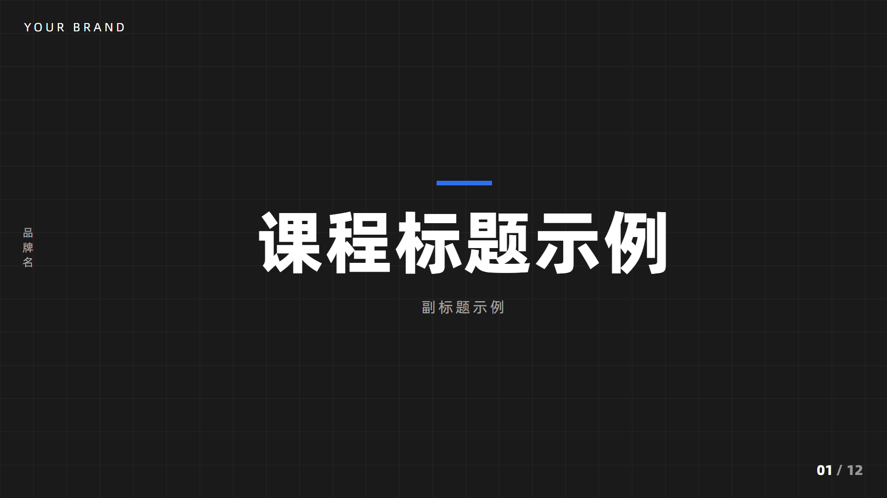

# PPT视频制作

从中文口播音频制作 16:9 商业培训课件视频（PPT 风格动画课件）的 HyperFrames Skill。

**能力**：口播音频 → 逐词时间戳转写 → 分页方案（编辑式排版，页数不限）→ HyperFrames 合成（页面与内容按口播词开始时间 30fps 帧级卡点）→ check/快照/渲染/ffprobe 全量验证。

## 使用方法

**一句话触发**：对 AI 说"用 PPT视频制作模板，把这段口播做成课件视频"，并提供以下信息：

| 信息 | 必填 | 说明 |
| --- | --- | --- |
| 口播音频文件 | 必填 | mp3/wav 等，中文口播 |
| 品牌名（中文） | 选填 | 左侧竖排显示；不需要可留空 |
| 品牌名（英文） | 选填 | 左上角显示；不需要可留空 |
| 配色（4 个色值） | 选填 | 主色 / 深主色 / 深色 / 浅色；不提供则用默认中性色 |

**执行流程**（AI 自动完成，无需干预）：

1. 转写音频，获得逐词时间戳（faster-whisper + ASR 融合）
2. 按口播内容切分页数（页数不限），每页绑定口播词开始时间
3. **先提交分页方案表给你确认**，确认后才制作
4. 生成 HyperFrames 合成并检查（布局/对比度/动画全绿）
5. 渲染 1920×1080 30fps MP4，逐页快照核对卡点后交付

**修改流程**：在已交付视频基础上提修改意见（如"某页加一句"），会自动原地更新并在文件名加版本号（v2/v3…），不覆盖旧文件。

## 案例效果

四种编辑式排版（深色大标题 / 浅色分栏 / 主色文字带 / 浅色流程横带），品牌与配色为占位示意：

## 内容

| 路径 | 说明 |
| --- | --- |
| `SKILL.md` | 触发说明、参数表、流程概览、关键规则 |
| `references/workflow.md` | 完整分步流程（转写、分页、工程、动画、验证） |
| `scripts/transcribe_words.py` | faster-whisper 逐词转写 |
| `scripts/merge_timeline.py` | ASR 段级时间轴 × 词级时间融合 |
| `scripts/build_timeline.py` | 页方案 → 每页 `data-start/data-duration/data-u` 词级绑定表 |
| `assets/composition-template.html` | 脱敏模板：21 种排版样式库 + 3 示例页 + 词级动画引擎 |

## 隐私

品牌名与配色均为参数（`BRAND_EN` / `BRAND_ZH` / `--accent` / `--accent-deep` / `--ink` / `--paper`），Skill 不内置任何个人或品牌信息。

## 依赖

Node 22+、FFmpeg、HyperFrames CLI（`npx hyperframes`）、`faster-whisper`、`zhconv`、mediakit-cli。
